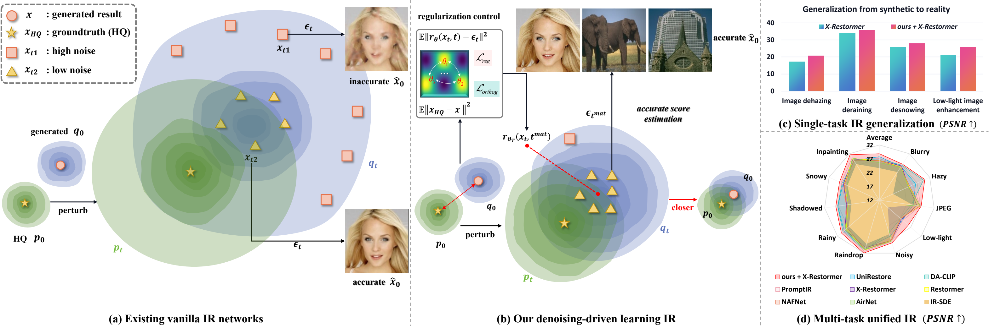
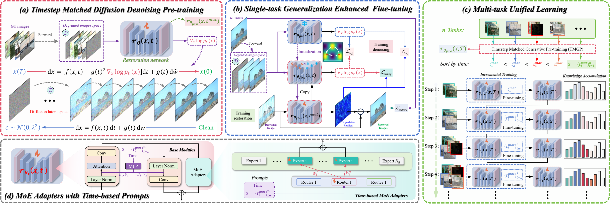

# Collaborative Diffusion-Reconstruction Learning for Generalizable and Unified Image Restoration
## DDL: Denoising-Driven Learning for Image Restoration
Official-style PyTorch implementation for:

> **Collaborative Diffusion-Reconstruction Learning for Generalizable and Unified Image Restoration**  
> Denoising-Driven Learning (DDL)

[](https://pytorch.org/)
[](https://www.python.org/)
[](#license)



DDL transfers diffusion-denoising supervision into efficient vanilla image
restoration networks. Instead of running iterative reverse diffusion at
inference time, DDL uses diffusion denoising during training to improve:

- **single-task OOD generalization** from synthetic training data to real data;
- **multi-task unified restoration** across 10 degradation types;
- **efficient inference**, because the final model remains a feed-forward
  restoration network.

## Method Overview



The code follows three stages:

| Stage | Script | What it does |
|---|---|---|
| Timestep-matched denoising pre-training | `train_pretrain.py` | trains the restoration network on clean GT images with diffusion perturbations |
| Generalization Enhanced Fine-tuning (GEF) | `train_finetune.py` | fine-tunes on paired restoration data using `L_content + L_reg + L_orthog` |
| Multi-task Unified Learning (MTUL) | `train_unified.py` | incrementally accumulates tasks sorted by matched timestep and adds time-conditioned MoE adapters |

The inference path is still simple:

```text
restored = degraded - DDLRestorationNet(degraded, t_mat)
```

## Repository Layout

```text
DDL/
  assets/                  # paper figures used by this README
  configs/
    ddl_tasks.py           # task aliases and matched timesteps
  datasets/
    datasets_pairs.py      # paired training/evaluation datasets
  docs/
    DATASETS.md            # dataset links and expected folder layout
    ACKNOWLEDGEMENTS.md    # baselines and project acknowledgements
  loss/
    losses.py
  networks/
    ddl_arch.py            # DDL restoration network
    diffusion_reg.py       # denoising loss, L_reg, L_orthog
    moe_adapter.py         # time-conditioned MoE adapters
    image_utils.py         # split/merge inference utilities
  scripts/                 # runnable command templates
  train_pretrain.py
  train_finetune.py
  train_unified.py
  inference.py
```

## Installation

```bash
git clone https://github.com/xin1u/DDL.git
cd DDL
conda create -n ddl python=3.10 -y
conda activate ddl
pip install -r requirements.txt
```

## Distributed Training

DDL provides single-node, multi-node, and SLURM launch templates in
[`infra/`](infra/). Typical commands:

```bash
GPUS_PER_NODE=8 bash infra/launch_pretrain.sh
GPUS_PER_NODE=8 TASK=dehazing bash infra/launch_finetune.sh
GPUS_PER_NODE=8 DATA_ROOT=/path/to/data bash infra/launch_unified.sh
```

For multi-node training, set `NNODES`, `NODE_RANK`, `MASTER_ADDR`, and
`MASTER_PORT`. For SLURM clusters, submit `infra/slurm_pretrain.sbatch`,
`infra/slurm_finetune.sbatch`, or `infra/slurm_unified.sbatch`.

## Quick Start

### 1. Denoising Pre-training

Pre-train on clean GT images from the original paired training datasets:

```bash
python train_pretrain.py \
  --gt_dir ./data/gt_images \
  --save_path ./ckpt \
  --diffusion_T 50 \
  --total_iters 100000 \
  --batch_size 16 \
  --lr 5e-5
```

### 2. Single-task Fine-tuning

Example for dehazing:

```bash
python train_finetune.py \
  --task dehazing \
  --pre_model ./ckpt/pretrained_model.pth \
  --training_in_path ./data/dehazing/train_input \
  --training_gt_path ./data/dehazing/train_gt \
  --eval_in_path ./data/dehazing/val_input \
  --eval_gt_path ./data/dehazing/val_gt \
  --total_iters 500000 \
  --lambda_reg 0.2 \
  --gen_prob 0.1 \
  --lambda_fft 0.1
```

### 3. Multi-task Unified Training

```bash
python train_unified.py \
  --pre_model ./ckpt/pretrained_model.pth \
  --data_root ./data \
  --tasks noisy,rainy,jpeg,snowy,inpainting,raindrop,shadowed,lowlight,hazy,blurry \
  --iters_per_task 100000 \
  --num_experts 10
```

### 4. Inference

```bash
python inference.py \
  --model_path ./ckpt/best_model.pth \
  --input_path ./data/dehazing/test_input \
  --gt_path ./data/dehazing/test_gt \
  --output_path ./results/dehazing \
  --task dehazing \
  --use_ensemble True
```
 
## Matched Timesteps

DDL uses a reduced diffusion discretization with `T=50`.

| Task | Noisy | Rainy | JPEG | Snowy | Inpainting | Raindrop | Shadowed | Low-light | Hazy | Blurry |
|---|---:|---:|---:|---:|---:|---:|---:|---:|---:|---:|
| `t_mat` | 4 | 8 | 12 | 15 | 19 | 22 | 27 | 38 | 47 | 50 |
| Ratio | 0.08T | 0.16T | 0.24T | 0.30T | 0.38T | 0.44T | 0.54T | 0.76T | 0.94T | T |

The same table is implemented in [`configs/ddl_tasks.py`](configs/ddl_tasks.py).

## Datasets

All datasets and protocols used in the paper are listed in
[`docs/DATASETS.md`](docs/DATASETS.md). Main links:

| Dataset | Link |
|---|---|
| DIV2K | https://data.vision.ee.ethz.ch/cvl/DIV2K/ |
| Flickr2K | https://cv.snu.ac.kr/research/EDSR/Flickr2K.tar |
| CBSD68 | https://github.com/cszn/DnCNN/tree/master/testsets/CBSD68 |
| LIVE1 | https://live.ece.utexas.edu/research/quality/subjective.htm |
| Rain100H / Rain13K | https://github.com/swz30/MPRNet |
| SPA+ / SPA-Data | https://github.com/stevewongv/SPANet |
| Snow100K | https://sites.google.com/view/yunfuliu/desnownet |
| RePaint protocol | https://github.com/andreas128/RePaint |
| RainDrop | https://github.com/rui1996/DeRaindrop |
| SRD | https://github.com/stevewongv/InstanceShadowDetection |
| LOL-v1 | https://daooshee.github.io/BMVC2018website/ |
| LOL-v2-real | https://github.com/caiyuanhao1998/Retinexformer |
| RESIDE / OTS | https://sites.google.com/view/reside-dehaze-datasets |
| REVIDE | https://github.com/BookerDeWitt/REVIDE_Dataset |
| GoPro | https://seungjunnah.github.io/Datasets/gopro |

## Multi-task Results Visualization


## Acknowledgements

DDL is implemented as a clean research codebase based on the paper's vanilla
restoration setting. We thank the authors of **X-Restormer**, the base method
used in our DDL experiments, and the authors of NAFNet/Restormer-style
restoration networks, IR-SDE, PromptIR, AirNet, DA-CLIP, ResShift, UniRestore,
EAMamba, DeepGSR, FDIN, and the public datasets listed above. See
[`docs/ACKNOWLEDGEMENTS.md`](docs/ACKNOWLEDGEMENTS.md) for details.

## Citation

```bibtex
@misc{lu2026ddl,
  title  = {Collaborative Diffusion-Reconstruction Learning for Generalizable and Unified Image Restoration},
  author = {Lu, Xin and Huang, Jie and Xiao, Jie and Fan, Zihao and Zhou, Ziang and Fu, Xueyang and Yin, Baocai},
  year   = {2026},
  note   = {Denoising-Driven Learning (DDL)}
}
```

## License

This repository is released for academic research. Dataset licenses and
third-party baseline licenses remain governed by their original authors.
